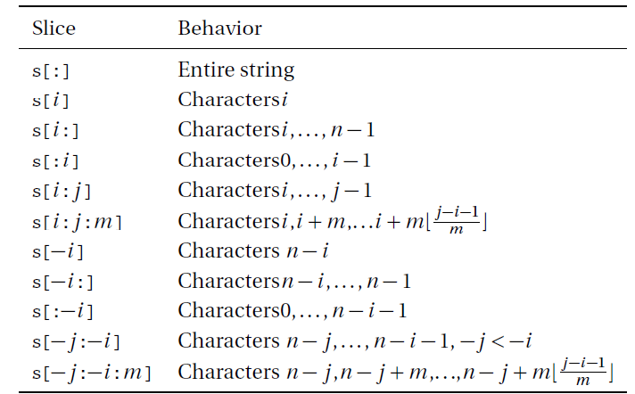

# 文件与字符串处理

## 0. 今日内容安排

今天咱们首先对“字符串”及其切片进行概要的介绍，然后通过excel和pdf这量种大家非常熟悉的文件格式来介绍python的文件处理方法，最后则是一个小小的项目：从pdf文件中提取数值，并写入excel表格。

## 1. 字符串相关

一个单独的'A'往往被认为是一个字符，但我们接触的数据往往会是许多字符的集合，这样的集合被称为“字符串”，在Python中，可以用一对英文的单引号`''`或是是一对英文双引号`""`将字符串围绕起来表示。关于其切片操作，找到一张图，总结得非常详细，大家可以参考一下。



## 2. 文件处理

### 2.1 excel

excel文件的处理将主要从文件的打开、修改及保存三个方面进行介绍。

**前提准备**：想要利用Python打开excel文件，首先需要引入一个模块`import openpyxl`

**打开/新建文档和工作表**：一个excel文档中可以有非常多的工作表，因此我们不仅是要打开一个文档，更是要定位到某一张表上，这个过程利用代码可以这样实现：

```Python
import openpyxl
# 打开文档
wb = openpyxl.load_workbook(example.xlsx)
# 定位到名字为‘sheet1’的表格
sheet = wb.get_sheet_by_name('sheet1')

# 新建文档
wb = openpyxl.Workbook()
sheet = wb.get_active_sheet()
```

**定位单元格、读取或修改其中值**：excel中，单元格定位是通过横纵两列的坐标进行定位，使用Python操作时候也是一样的：

```Python
# 接上一段代码
# 定位到A1单元格
cell = sheet['A1']

# 取出其中的数值
cell.value
# 通过直接赋值的方式修改其中数值
cell = 'XCJ'
```

**保存文档**：仅仅是通过代码修改的数据，就像我们直接在excel里面进行了修改一样，改动并没有被保存，这时候需要进行保存的操作才可以被记录下。（友情提示大家：office三件套常保存）

```Python
# 续上
wb.save('example.xlsx')
# 当然也可以起其他的名字，这里只是做一个例子而已
```

今天作为初步了解，咱们就先介绍到这里，后面到图表制作时候，还有excel的戏份，敬请期待~

### 2.2 pdf

pdf一般不讨论对它直接进行编辑修改，因此这部分主要讨论怎么从pdf文件中提取信息和如何新建保存一个pdf文件。

**前提准备**：想要利用Python打开pdf文件，首先需要引入一个模块`import PyPDF2`

**打开/新建文档和工作表**：一个pdf文档中可以有非常多页，因此我们不仅是要打开一个文档，更是要定位到某一页，这个过程利用代码可以这样实现：

```Python
import PyPDF2
# 打开文档(变量名可以自定义)
pdfFileobj = open('example.pdf', 'rb')
pdfReader = PyPDF2.pdfFileReader(pdfFileobj)
# 定位到第1页
pageobj = pdfReader.getPage(0)
# 提取第1页的内容
pageobj.extractText()
```

**新建并保存文档**：利用PyPDF2模块需要有一个“写入专用”的“容器”，这里我们不妨叫它输出对象。可以联想为在打印店打印资料时候点击“打印”之后弹出的那个打印进度窗口。

```Python
# 实例化一个输出对象
pdfWriter = PyPDF2.pdfFileWriter()

# 调用addPage()往输出对象里面加入要输出的内容（an_obj），要输出的内容需要根据之后的实际应用来改变，这里仅算是展示用例
pdfWriter.addPage(an_obj)

# 这里就是新建一个空的pdf文件了，同样地名字可以自己修改
pdf_outp = open('example_output.pdf', 'wb')

# 下面这一行则是把之前输出对象装好的页面等信息写到新建的pdf文件里面
pdfWriter.write(pdf_outp)

```

## 3. 简易填表项目

这个小练习灵感来源于之前一凡薪火相传时候的分享：她说她在做审计实习的时候，需要一边打开pdf，一边比对电子表格中的信息。我当时觉得这可以用编程帮助减少工作量，但是今天在这里稍作简化，**咱们今天的目标是**：从d3.pdf中将信息逐行提取出来，放到新建的excel电子表格中，保存。
